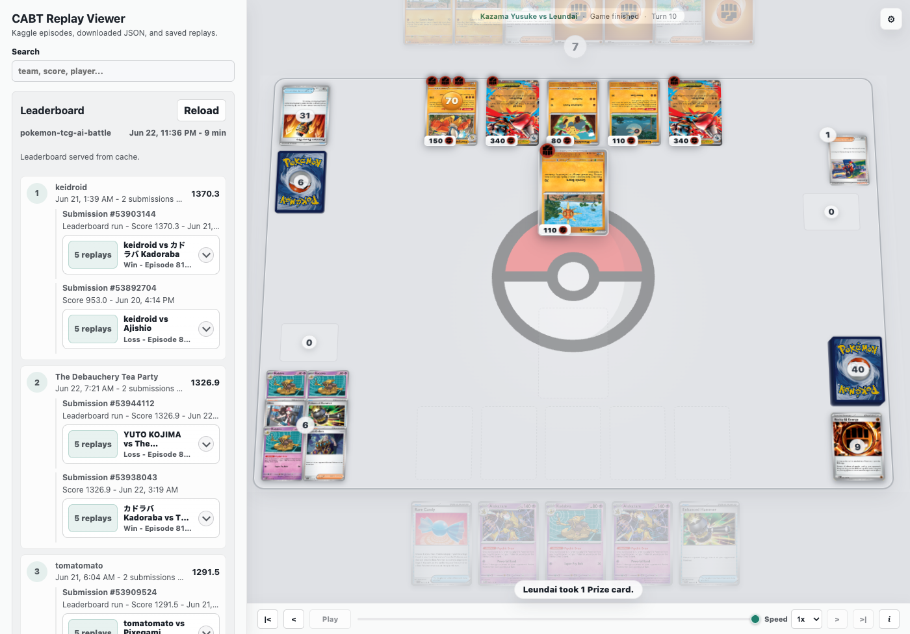

# CABT Replay Viewer

Public replay viewer for the Kaggle Pokemon TCG AI Battle CABT environment.

This repo is intentionally focused on viewing and searching replays. It does
not include private agents, sample submissions, training code, or local battle
runner logic.



## What Is Included

- Svelte replay viewer with timeline playback, side switching, pile viewers,
  card inspection, and JSON drag/drop import.
- FastAPI backend that keeps Kaggle credentials server-side.
- File-backed replay library for local and Railway deployments.
- Direct Kaggle HTTP adapter for cached leaderboard pulls, submissions,
  episodes, and replay imports.
- Dockerfile and `railway.json` for Railway deployment.

The bundled demo replay is a public fixture for smoke testing the viewer.

## Architecture

```text
web/                 Svelte 5 replay UI
api/                 FastAPI backend
api/app/kaggle_*     Server-side Kaggle adapter
api/app/replay_*     Replay storage interface
.data/               Local replay store, ignored
```

The first storage adapter is file-backed to keep the deployment simple. The
backend interface is deliberately shaped so it can move to Postgres, object
storage, and background queues later without changing the viewer.

## Local Development

Install web dependencies:

```bash
npm --prefix web ci
```

Run the API:

```bash
python -m venv .venv
. .venv/bin/activate
pip install --require-hashes -r api/requirements.lock
uvicorn api.app.main:app --reload
```

Run the web app in another terminal:

```bash
npm --prefix web run dev
```

Open `http://127.0.0.1:5173`.

## Kaggle Auth

Kaggle access is handled only by the backend. Do not put Kaggle credentials in
browser code.

For local or Railway use, set a server-side Kaggle API token:

```bash
KAGGLE_API_TOKEN=your-kaggle-api-token
```

Legacy Kaggle API credentials are also supported:

```bash
KAGGLE_USERNAME=your-kaggle-username
KAGGLE_KEY=your-kaggle-api-key
```

Live Kaggle replay-import actions are admin-protected. Set `CABT_ADMIN_TOKEN`
on the backend, then unlock the viewer's Kaggle admin controls with the private
hotkey and that token when importing episodes. The token is held only in memory
for the current page session. Local JSON drag/drop opens and saves in the
browser without a token. The backend replay upload endpoint still requires
admin access unless `CABT_ALLOW_PUBLIC_IMPORTS=true` is set for local
development; that flag does not unlock admin Kaggle endpoints.

The public leaderboard panel reads from a server-side cache. The viewer polls
the cache, and the backend refreshes from Kaggle only when the cached snapshot
is stale. The default cache window is 30 minutes:

```bash
KAGGLE_DEFAULT_COMPETITION=pokemon-tcg-ai-battle
KAGGLE_LEADERBOARD_CACHE_SECONDS=1800
KAGGLE_LEADERBOARD_PAGE_SIZE=50
```

Saved replay artifacts are publicly readable from the hosted replay library. Use
local JSON drag/drop for private inspection, and only save/import replays that
are safe to publish.

## Railway

This repo is ready for Railway with the included Dockerfile.

Recommended variables:

```text
CABT_DATA_DIR=/data
CABT_ADMIN_TOKEN
KAGGLE_USERNAME
KAGGLE_KEY
KAGGLE_DEFAULT_COMPETITION=pokemon-tcg-ai-battle
KAGGLE_LEADERBOARD_CACHE_SECONDS=1800
```

Attach a Railway volume mounted at `/data` so imported replays survive
redeploys. Without a volume the service still runs, but the replay library is
ephemeral.

The backend rejects replay payloads over `CABT_MAX_REPLAY_BYTES` (25 MB by
default) and keeps at most `CABT_MAX_STORED_REPLAYS` artifacts (500 by default)
in the file-backed replay store.

The container listens on `$PORT` and defaults to `8080`. The service healthcheck
is `/api/health`.

## Tests

```bash
npm --prefix web run build
npm --prefix web test
npm --prefix web run test:e2e
python -m pytest
```

## License

MIT. The viewer began from Charlie Lockyer's MIT-licensed CABT viewer work and
has been extracted into this replay-focused public project.
